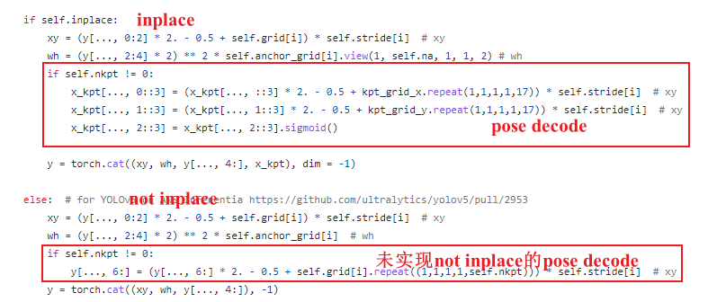
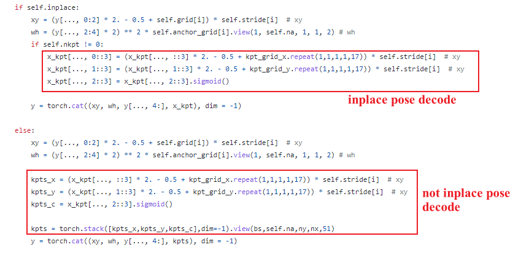

# Detect类forward函数修改以加速TensorRT
### Inplace操作
&emsp;&emsp;首先需要知道inplace操作是什么，也就是原地操作，对于一个变量经过运算后仍保存在原来的内存地址上，很多激活函数都有inplace=True的操作，可以节约显存，具体可自行百度。

### YOLO-Pose源代码存在的问题
&emsp;&emsp;在models/yolo.py代码中，YOLO-Pose作者[源代码](https://github.com/TexasInstruments/edgeai-yolov5/blob/yolo-pose/models/yolo.py#L85)的推理函数`Detect类的forward函数`的pose的decode部分只实现了inplace的decode操作，这些操作在转换为onnx是会产生大量的冗余算子，导致onnx转换为TensorRT时不能很好的加速，而非inplace部分作者的实现仍然是inplace的，并且对于关键点置信度的解码也是有误的，和inplace部分的解码不一致，如下图所示：

### 实现not inplace的pose decode
&emsp;&emsp;inplace转not inplace很简单，只要把姿态点的x坐标、y坐标、置信度运算后的结果分别单独用一个变量保存，然后将三者拼接回原来的顺序和形状即可，修改后如下图所示：

&emsp;&emsp;实际测试在Jetson Xavier NX上，yolov5s6_pose_640模型，在修改前导出的onnx模型算子约有1000多，转为TensorRT后的推理耗时约为160ms，而修改后以not inplace的方式导出的onnx算子数为300多，转为TensorRT后的推理耗时在10-20ms之间。